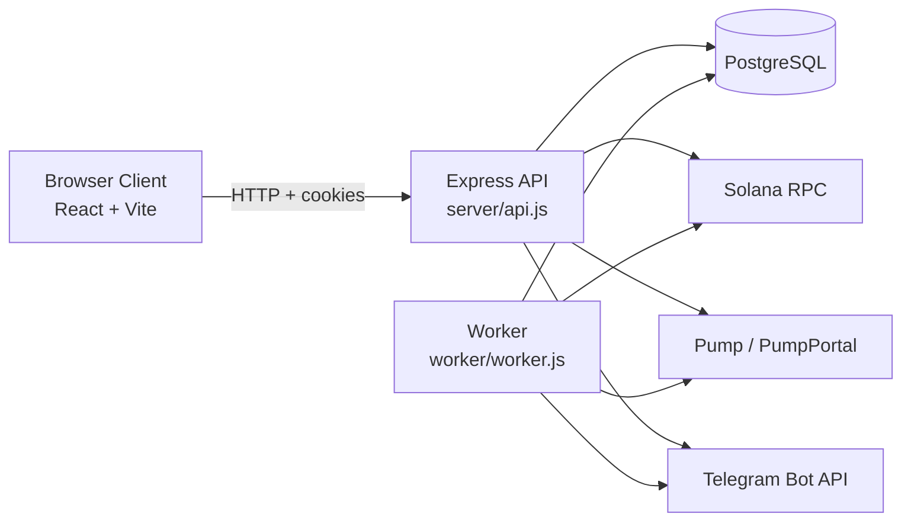

# EMBER.nexus

<p align="center">
  
</p>

<p align="center">
  
</p>

<p align="center">
  Advanced Solana execution infrastructure for token teams.
</p>

<p align="center">
  <a href="https://ember.nexus">Site</a> ·
  <a href="https://x.com/i/communities/2029665598809198626">X Community</a> ·
  <a href="https://t.me/ember_nexus">Telegram</a>
</p>

<p align="center">
  =20" />
  
  
  
  
</p>

## Overview

EMBER.nexus lets token teams deploy, attach, and operate Solana execution bots from a single stack.

Current platform capabilities in this repository:

- Burn Bot
- Volume Bot
- Market Maker Bot
- DCA Bot
- Rekindle Bot
- branded `EMBR` / `EMBER` wallet pool
- branded or regular deploy-wallet flow
- creator-reward funding, external funding, or hybrid funding
- manager access for shared account operations
- Telegram user alerts
- referrals, OG fee exemptions, and protocol fee routing

This repo contains the full platform runtime:

- `web/` Vite + React frontend
- `server/` Express API and execution core
- `worker/` scheduler and on-chain executor

## What EMBER Does

The platform is built around attached-token execution.

- **Burn Bot** converts available value into buybacks and supply reduction.
- **Volume Bot** creates controlled chart activity across deposit and trade wallets.
- **Market Maker Bot** runs attached-token two-sided execution around an inventory target.
- **DCA Bot** steadily accumulates the attached token.
- **Rekindle Bot** waits for pullbacks, then buys weakness under cooldown-aware rules.

The wallet layer supports:

- **Branded attach wallets** from the `EMBR` / `EMBER` pool
- **Regular random wallets** for users who do not want vanity addresses
- **Branded deploy wallets** for the backend-managed deploy path

That means users can choose whether they want branded wallet attribution or a normal random Solana wallet.

## Core Product Model

### 1. Attach a token

Users attach a token and pick a bot strategy.

### 2. Fund the bot

Bots can run from:

- creator rewards
- external SOL deposits
- hybrid funding

### 3. Execute on-chain

The worker executes claims, buys, sells, burns, treasury routing, gas top-ups, and wallet fanout against Solana.

### 4. Observe everything

The dashboard and public surfaces read from token events, bot state, and protocol metrics for live visibility.

## Account Model

The account system currently supports:

- **Primary owner**
  - full control
- **Manager**
  - can operate the account
  - cannot withdraw
  - cannot sweep
  - cannot delete

This is intentionally simpler than a full team/invite model.

## Fees, Referrals, and OG Accounts

Current billing logic in the repo:

- **Standard account**
  - `10%` total protocol fee
  - `5%` treasury
  - `5%` burn

- **Referred account**
  - `10%` total protocol fee
  - `2.5%` treasury
  - `2.5%` burn
  - `5%` referral credit

- **OG account**
  - `0%` protocol fees

Referral earnings are tracked in-account and claimable by the account owner.

## Architecture



PostgreSQL is the source of truth for:

- users and sessions
- token state
- module config and runtime state
- wallet metadata
- event history
- referrals and protocol settings

## Runtime Components

### Web

The frontend renders:

- homepage and docs
- deploy flow
- attach flow
- dashboard
- live logs
- public ticker
- burn metrics

### API

The API is responsible for:

- auth and cookies
- token attach/update/delete/archive flows
- deploy orchestration
- dashboard/public payloads
- wallet reservation
- admin, referral, manager, and Telegram settings

### Worker

The worker is responsible for:

- scheduling module jobs
- claim execution
- trade execution
- burn execution
- protocol-owned bot execution
- fee routing
- event creation

## Bot Coverage In This Repo

| Module | Status | Notes |
|---|---|---|
| Burn Bot | Implemented | Claim + buyback + burn path |
| Volume Bot | Implemented | Trade-wallet fanout and buy/sell loops |
| Market Maker Bot | Implemented | Attached-token inventory-targeted execution |
| DCA Bot | Implemented | Recurring attached-token accumulation |
| Rekindle Bot | Implemented | Pullback-triggered attached-token buying |
| AI Trading | Not implemented | UI/roadmap only |

## GitHub / Repo Notes

This repository is the platform codebase. It intentionally does **not** include:

- private keys
- live production secrets
- hosted service configuration values
- internal operational credentials

If any credential is exposed, rotate it immediately.

## Local Development

### Prerequisites

- Node.js `>=20`
- PostgreSQL
- Solana RPC endpoint

### Install

```bash
npm install
```

Create `.env` from `.env.example` and fill in the required values.

### Run locally

```bash
npm run dev
```

Default local endpoints:

- web: `http://localhost:5173`
- api: `http://localhost:3002` if `PORT=3002`

If you split web and API locally, make sure `VITE_API_BASE_URL` points to the running API port.

## Environment

Use `.env.example` as the template.

Critical production variables:

- `DATABASE_URL`
- `SOLANA_RPC_URL`
- `DEPOSIT_KEY_ENCRYPTION_KEY`
- `VITE_API_BASE_URL`
- cookie settings if web and API are on separate origins

Notable execution variables:

- `TREASURY_WALLET`
- `TREASURY_WALLET_PRIVATE_KEY`
- `DEV_WALLET_PRIVATE_KEY`
- `BOT_SOL_RESERVE`
- `CLAIM_GAS_TOPUP_SOL`
- `VOLUME_DEFAULT_MIN_TRADE_SOL`
- `VOLUME_DEFAULT_MAX_TRADE_SOL`

Wallet-pool variables:

- `DEPOSIT_VANITY_PREFIX`
- `DEPOSIT_VANITY_THREADS`
- `DEPOSIT_VANITY_TIMEOUT_MS`
- `DEPOSIT_POOL_TARGET`
- `DEPOSIT_POOL_REFILL_INTERVAL_MS`
- `DEPOSIT_KEY_ENCRYPTION_KEY`

## Useful Scripts

```bash
npm run dev
npm run build
npm run start
npm run start:api
npm run start:worker
npm run db:status
npm run db:export -- --file ./db-snapshot.json
npm run db:import -- --file ./db-snapshot.json
npm run db:reset
```

## API Surface

Main routes currently exposed by the app:

| Method | Path | Auth | Purpose |
|---|---|---|---|
| `GET` | `/api/health` | Public | Health check |
| `GET` | `/api/public-metrics` | Public | Public protocol metrics |
| `GET` | `/api/public-dashboard` | Public | Public ticker and logs payload |
| `GET` | `/api/auth/me` | Optional | Current session |
| `POST` | `/api/auth/register` | Public | Register account |
| `POST` | `/api/auth/login` | Public | Login |
| `POST` | `/api/auth/logout` | Optional | Logout |
| `GET` | `/api/dashboard` | Required | Full user dashboard |
| `POST` | `/api/tokens` | Required | Attach token |
| `PATCH` | `/api/tokens/:id` | Required | Update token/module config |
| `DELETE` | `/api/tokens/:id` | Required | Archive token |
| `POST` | `/api/tokens/:id/restore` | Required | Restore archived token |
| `POST` | `/api/deploy` | Optional | Wallet-signed deploy path |
| `POST` | `/api/deploy/record` | Optional | Persist deploy result |

## Deployment Notes

The current production shape is:

- one API service
- one worker service
- one web build/output
- one shared PostgreSQL database

API and worker must point at the same database and Solana execution environment.

## Security Notes

- `.env` is gitignored
- wallet keys can be encrypted at rest
- signing happens server-side only when required for execution
- referral, manager, and admin privileges are backend-enforced, not frontend-only

## Status

This repo reflects the actively developed EMBER.nexus platform, including the branded wallet pool, deploy wallet reservation flow, manager access, Telegram user alerts, referrals, and the current live bot lineup.
