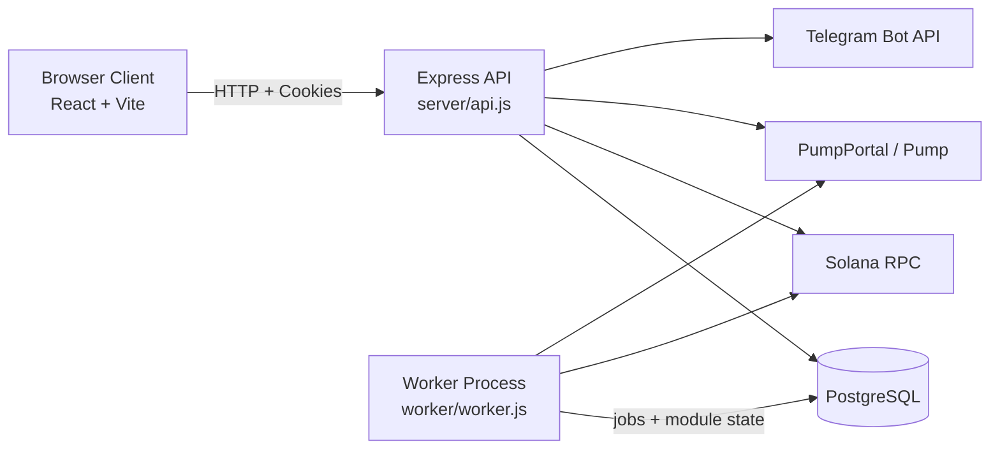

# EMBER.nexus

Advanced Solana execution infrastructure for token teams: deploy, attach, and run on-chain automation with API-backed observability.

This repository contains the full runtime stack:
- `web/` React + Vite frontend
- `server/` Express API + execution core
- `worker/` scheduler/executor process


Links:
- Site: `https://ember.nexus`
- X: `https://x.com/satoshEH_`
- Telegram: `https://t.me/ember_nexus`
- GitHub: `https://github.com/embernexus`

## Platform Snapshot

| Capability | Status | Notes |
|---|---|---|
| Burn Bot | Implemented | Token attach, claim intervals, burn execution pipeline, event logging |
| Volume Bot | Implemented | Per-token module config, trade wallet fanout, execution loop, event logging |
| Deploy Flow | Implemented | Wallet-signed deploy transaction path via Pump/PumpPortal from frontend |
| Account Isolation | Implemented | Per-user auth session + token ownership enforced in API/DB |
| Protocol Metrics | Implemented | Public metrics endpoint + dashboard aggregation |
| Telegram Announcements | Implemented | Outbound channel announcements for attach/deploy events when bot/chat env vars are configured |

Not included in this repo version:
- Market Maker bot execution module
- AI Trading bot execution module
- Mobile app / extension release artifacts

## Architecture



The frontend drives user actions, the API owns auth/state validation and orchestration, and the worker executes scheduled module jobs against on-chain infrastructure. PostgreSQL is the source of truth for accounts, token/module state, events, and wallet metadata.

## Core Capabilities (Implemented)

- Token attach + module configuration from web UI
- Funding model support for creator rewards and external wallet funding
- Per-account isolation for tokens, sessions, and execution state
- Protocol-generated `EMBR` wallet pool with server-side key custody
- Encrypted private-key-at-rest support (`DEPOSIT_KEY_ENCRYPTION_KEY`)
- Real event ingestion + dashboard/metrics visibility
- Wallet-signed token deploy flow via Pump/PumpPortal integration

## Quick Start (Local)

### Prerequisites

- Node.js `>=20` (see `package.json` engines)
- PostgreSQL connection string (`DATABASE_URL`)
- Solana RPC endpoint (`SOLANA_RPC_URL`)

### Setup

```bash
npm install
```

Create `.env` from `.env.example` and set required values.

Then run web + API + worker together:

```bash
npm run dev
```

Default local addresses:
- Web (Vite): `http://localhost:5173`
- API default in code: `http://localhost:3001` (`PORT` env)

Important:
- If your local `.env` sets `PORT=3002`, API will run on `3002`.
- `VITE_API_BASE_URL` must point to your actual API port to avoid auth/upgrade mismatches.

## Environment Variables

Use `.env.example` as the canonical template.

### Core Runtime

| Variable | Required | Purpose |
|---|---|---|
| `DATABASE_URL` | Yes | Postgres connection string |
| `PORT` | Yes (deploy) | API listen port |
| `SESSION_COOKIE_NAME` | Recommended | Session cookie key |
| `SESSION_TTL_DAYS` | Recommended | Session lifetime |
| `MAX_TOKENS_PER_ACCOUNT` | Recommended | Per-account token cap |
| `WORKER_TICK_MS` | Recommended | Worker scheduler interval |

### Solana / Execution

| Variable | Required | Purpose |
|---|---|---|
| `SOLANA_RPC_URL` | Yes | Main RPC endpoint for on-chain reads/writes |
| `TREASURY_WALLET` | Recommended | Treasury destination wallet |
| `BASE_PRIORITY_FEE_SOL` | Optional | Base tx priority fee configuration |
| `BOT_SOL_RESERVE` | Optional | Reserve floor for bot wallets |
| `VOLUME_DEFAULT_MIN_TRADE_SOL` | Optional | Default volume min trade |
| `VOLUME_DEFAULT_MAX_TRADE_SOL` | Optional | Default volume max trade |

### Deploy / Pump

| Variable | Required | Purpose |
|---|---|---|
| `PUMPPORTAL_API_KEY` | Optional | PumpPortal key if required by your routing path |
| `DEV_WALLET_PRIVATE_KEY` | Optional | Supports JSON byte array or base58 secret key |

### Telegram Announcements

| Variable | Required | Purpose |
|---|---|---|
| `TELEGRAM_BOT_TOKEN` | Optional | Bot token for outbound messages |
| `TELEGRAM_CHAT_ID` | Optional | Channel/chat destination |
| `TELEGRAM_TOPIC_ID` | Optional | Forum topic id if using topics |

### Wallet Security / Vanity Pool

| Variable | Required | Purpose |
|---|---|---|
| `DEPOSIT_KEY_ENCRYPTION_KEY` | Strongly recommended (prod) | 32-byte key (hex/base64) for wallet-key encryption at rest |
| `SOLANA_KEYGEN_BIN` | Recommended | `solana-keygen` binary path |
| `DEPOSIT_VANITY_PREFIX` | Optional | Vanity prefix target (`EMBR`) |
| `DEPOSIT_VANITY_THREADS` | Optional | Keygen thread count |
| `DEPOSIT_POOL_TARGET` | Optional | Pre-warmed deposit pool target |
| `DEPOSIT_POOL_REFILL_INTERVAL_MS` | Optional | Refill loop interval |

### Frontend Public Vars

| Variable | Required | Purpose |
|---|---|---|
| `VITE_API_BASE_URL` | Yes | Frontend API base URL |
| `VITE_SOLANA_RPC_URL` | Recommended | Frontend quote/curve reads |
| `VITE_X_URL` | Optional | Navbar social link |
| `VITE_TELEGRAM_URL` | Optional | Navbar social link |
| `VITE_GITHUB_URL` | Optional | Navbar social link |
| `VITE_BUY_EMBER_URL` | Optional | Buy button target |

Critical production set:
- `DATABASE_URL`
- `SOLANA_RPC_URL`
- `DEPOSIT_KEY_ENCRYPTION_KEY`
- `VITE_API_BASE_URL`
- cookie settings when web/API are split domains:
  - `COOKIE_SECURE=true`
  - `COOKIE_SAME_SITE=none`

## Deployment Runbook (Railway)

Deploy as two services from this repo:

1. `ember-api`
- Build: `npm ci && npm run build`
- Start: `npm run start`
- Must share env and Postgres with worker

2. `ember-worker`
- Build: `npm ci`
- Start: `npm run start:worker`
- Must use same DB + execution env as API

Attach both services to the same PostgreSQL instance.

### Preflight Checklist (Before Public Launch)

- `VITE_API_BASE_URL` points at production API domain
- Session cookie behavior verified in production domain model
- `DATABASE_URL` and `SOLANA_RPC_URL` are set and validated
- `DEPOSIT_KEY_ENCRYPTION_KEY` configured
- Telegram announcement vars set if announcements are required
- Placeholder values (e.g., token contract) replaced

## Data Portability

Use built-in portability scripts when migrating providers or restoring state:

```bash
# Export from current DB
DATABASE_URL=... npm run db:export -- --file ./db-snapshot.json

# Import into target DB
DATABASE_URL=... npm run db:import -- --file ./db-snapshot.json

# Verify row counts/status
DATABASE_URL=... npm run db:status
```

Use this flow when moving between Render, Railway, Supabase, self-hosted Postgres, or VM-based Postgres to keep runtime state consistent.

## Security Notes

- Secrets are never committed; `.env` is ignored by git.
- If any credential is exposed, rotate it immediately (DB password, RPC key, bot tokens).
- Deposit wallet keys can be encrypted at rest using `DEPOSIT_KEY_ENCRYPTION_KEY`.
- Decryption/signing occurs server-side in runtime only.
- This README intentionally avoids publishing exploit-sensitive execution internals.

## API Surface (Current)

| Method | Path | Auth | Purpose |
|---|---|---|---|
| `GET` | `/api/health` | Public | Health check |
| `GET` | `/api/public-metrics` | Public | Public protocol metrics |
| `GET` | `/api/auth/me` | Optional | Current session user |
| `POST` | `/api/auth/register` | Public | Create account + session |
| `POST` | `/api/auth/login` | Public | Login + session |
| `POST` | `/api/auth/logout` | Optional | Clear session |
| `GET` | `/api/dashboard` | Required | User dashboard payload |
| `POST` | `/api/tokens` | Required | Attach token/module config |
| `POST` | `/api/tokens/generate-deposit` | Required | Reserve/generate deposit address |
| `POST` | `/api/tokens/resolve-mint` | Required | Resolve mint metadata |
| `PATCH` | `/api/tokens/:id` | Required | Update token/module settings |
| `GET` | `/api/tokens/:id/details` | Required | Live token/module details |
| `DELETE` | `/api/tokens/:id` | Required | Delete token/module (guarded) |
| `POST` | `/api/deploy` | Optional | Deploy orchestration endpoint |
| `POST` | `/api/deploy/record` | Optional | Persist post-deploy chain result |

## Troubleshooting

1. Wrong API URL / "Upgrade Required"
- Ensure `VITE_API_BASE_URL` points to the running API (e.g., `http://localhost:3002` if `PORT=3002`).
- Restart Vite after changing env vars.

2. Session/cookie issues across domains
- Set `COOKIE_SECURE=true` and `COOKIE_SAME_SITE=none`.
- Ensure HTTPS is enabled in production.

3. RPC errors / `403` / failed on-chain calls
- Verify `SOLANA_RPC_URL` is valid and funded for your provider tier.
- Check provider limits and key validity.

4. Git push permission mismatch
- Confirm VS Code/Git auth account has write access to repo origin.
- Clear cached GitHub credentials if needed and re-auth.

5. Missing env variable startup failures
- API and worker require `DATABASE_URL`.
- Execution paths require `SOLANA_RPC_URL`.
- Encryption paths require `DEPOSIT_KEY_ENCRYPTION_KEY` for protected key storage.

6. Deposit pool warm-up delay
- `EMBR` vanity generation can take time.
- Keep `DEPOSIT_POOL_TARGET` and refill settings tuned for expected attach volume.

## Repository Layout

```text
web/       React + Vite frontend
server/    Express API, core execution logic, DB bootstrap
worker/    Scheduler/executor process
scripts/   Operational utilities (DB portability)
```

## Status + Scope

Implemented in this version:
- Burn and Volume module foundation
- Deploy flow integration
- API-backed dashboard + metrics
- Postgres-backed state and worker execution loop
- Telegram outbound announcements (env-enabled)

Not included yet in this version:
- Market Maker execution module
- AI Trading execution module
- Mobile/extension packaging
