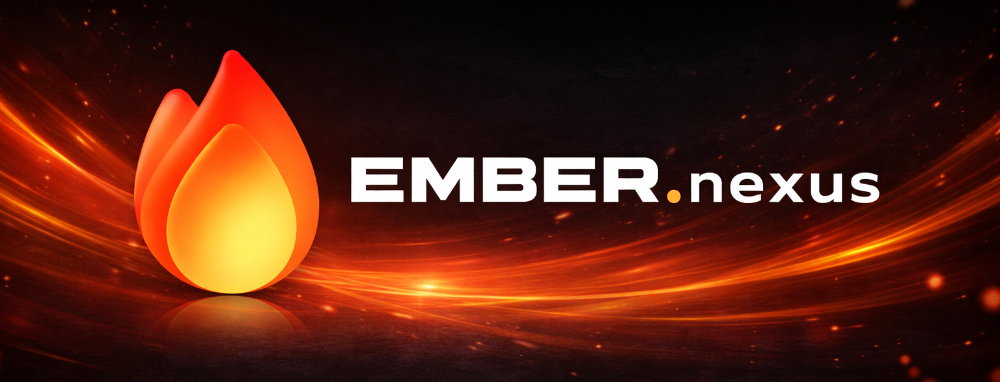
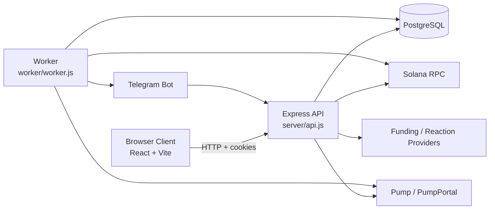

# EMBER.nexus

<p align="center">
  
</p>

<p align="center">
  
</p>

<p align="center">
  Advanced Solana execution infrastructure for token teams.
</p>

<p align="center">
  <a href="https://ember.nexus">Site</a> |
  <a href="https://x.com/i/communities/2029665598809198626">X Community</a> |
  <a href="https://t.me/ember_nexus">Telegram</a>
</p>

<p align="center">
  =20" />
  
  
  
  
</p>

## Overview

EMBER.nexus is a Solana execution platform for token teams. It combines branded wallet infrastructure, attached-token automation, Telegram-first operations, deploy tooling, and public burn telemetry in one stack.

Current platform coverage in this repository:

- Burn Bot
- Volume Bot
- Market Maker
- DCA
- Rekindle
- Holder Pooler
- Reaction Manager
- Smart Sell
- Bundle Manager
- branded `EMBR` / `EMBER` wallet pool
- branded or regular deploy-wallet flow
- Telegram tools, bots, deploy, and trade controls
- direct funding and EMBER-managed funding modes for wallet-based tools
- team access, referrals, OG billing, and admin controls

This repository contains the full runtime:

- `web/` Vite + React frontend
- `server/` Express API and execution core
- `worker/` scheduler and on-chain executor

## Highlights

- branded `EMBR` / `EMBER` wallet reservation and deploy flow
- Telegram-first controls for bots, tools, deploy, and trade
- public ticker, burn metrics, and live logs
- owner/team access model with restricted custody actions
- referrals, OG billing, and admin control surface

## Product Surface

### Bots

- **Burn Bot** converts available value into buybacks and supply reduction.
- **Volume Bot** runs controlled chart activity across deposit and trade wallets.
- **Market Maker** manages attached-token inventory and alternates buy/sell pressure around a target.
- **DCA** steadily accumulates the attached token.
- **Rekindle** buys pullbacks under cooldown-aware rules.

### Tools

- **Holder Pooler** spreads token balances across generated wallets for holder distribution.
- **Reaction Manager** runs one-reaction-at-a-time DexScreener campaigns against a target URL.
- **Smart Sell** reacts to buy flow with configurable sell behavior across managed wallets.
- **Bundle Manager** coordinates managed or imported wallet bundles for buy and sell campaigns.

### Wallet Infrastructure

- branded attach wallets from the `EMBR` / `EMBER` pool
- regular random wallets for users who do not want vanity attribution
- branded or regular deploy wallets for backend-managed deploys
- direct and EMBER-managed funding modes for wallet-based tools

## Telegram Surface

The platform is not web-only.

Telegram supports:

- bot control
- tool creation and management
- token deploy setup
- trading-wallet creation, import, buy, sell, and withdraw

The Telegram surface is button-first and shares the same backend command layer as the web app.

## Account Model

The account model is intentionally simple:

- **Primary owner**
  - full control
- **Team access**
  - can operate the account
  - cannot withdraw
  - cannot sweep
  - cannot delete

## Fees, Referrals, and OG Accounts

Current billing logic in the repo:

- **Standard account**
  - `10%` total protocol fee
  - `5%` treasury
  - `5%` burn

- **Referred account**
  - `10%` total protocol fee
  - `2.5%` treasury
  - `2.5%` burn
  - `5%` referral credit

- **OG account**
  - `0%` protocol fees

Referral earnings are tracked in-account and claimable by the primary owner.

## Architecture



PostgreSQL is the source of truth for:

- users and sessions
- token state
- module config and runtime state
- tool instances and events
- wallet metadata
- referrals and protocol settings

## Runtime Components

### Web

The frontend renders:

- homepage and docs
- deploy flow
- attach flow
- tools
- dashboard
- live logs
- public ticker
- burn metrics

### API

The API is responsible for:

- auth and cookies
- token attach/update/delete/archive flows
- deploy orchestration
- tool creation and control
- Telegram control flows
- dashboard and public payloads
- wallet reservation
- admin, referral, team-access, and Telegram settings

### Worker

The worker is responsible for:

- scheduling module jobs
- claim execution
- trade execution
- burn execution
- protocol-owned bot execution
- fee routing
- event creation

## Local Development

### Prerequisites

- Node.js `>=20`
- PostgreSQL
- Solana RPC endpoint

### Install

```bash
npm install
```

Create `.env` from `.env.example` and fill in the required values.

### Run locally

```bash
npm run dev
```

Default local endpoints:

- web: `http://localhost:5173`
- api: `http://localhost:3002` when `PORT=3002`

If you split web and API locally, make sure `VITE_API_BASE_URL` points to the running API port.

## Environment

Use `.env.example` as the template.

Critical production variables:

- `DATABASE_URL`
- `SOLANA_RPC_URL`
- `DEPOSIT_KEY_ENCRYPTION_KEY`
- `VITE_API_BASE_URL`

Notable execution variables:

- `TREASURY_WALLET`
- `TREASURY_WALLET_PRIVATE_KEY`
- `DEV_WALLET_PRIVATE_KEY`
- `BOT_SOL_RESERVE`
- `CLAIM_GAS_TOPUP_SOL`
- `VITE_BUY_EMBER_URL`
- Telegram and provider keys used by the platform surfaces

## Repository Notes

This repository intentionally does not include:

- live private keys
- production secrets
- hosted service credentials
- internal operational credentials

If any credential is exposed, rotate it immediately.
